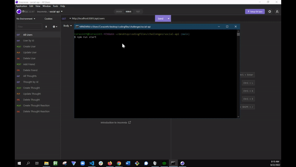

# Social-Api

## Description 

This is a simple CRUD API for a social media site. It includes routes for creating users, thoughts (which are posts), reactions(which are comments), and adding/deleting friends.

The site uses Express for the routes and Mongoose to store data about the users and their associated thoughts, thoughts and their associated reactions, and who is friends with whom. 

A video demo of the site can be found [here](https://drive.google.com/file/d/13DSb6uUT4b62LCyLpue5JgxIBEpDcYTU/view).

## Table of Contents

* [Features](#features)
* [Usage](#usage)
* [License](#license)

## Features 

As an API the site does not have many features, however Mongoose provides validators for email fields and ensures that thoughts and reactions have actual content associated with them, as well as a maxiumum length.

## Usage 

To use the API, simply type in the routes into your favorite route checker such as insomnia. Below is a gif demonstrating this functionality, though you can also see the video in the description above.

## [License](./LICENSE)
This website uses the open-source MIT License.
--- 